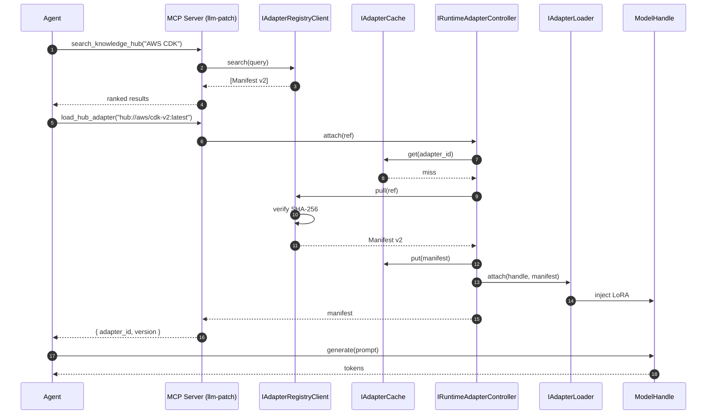

# Agentic AI Integration — The Adapter Market

> **Status**: canonical use case for `llm-patch` ≥ `0.2.0`. This
> document is the bridge between the engine's pluggable internals and
> a real-world delivery story: a **distributed market of versioned LoRA
> adapters** that autonomous agents can search, pull, and hot-swap on
> demand.
>
> Authoritative sub-documents:
> [REGISTRY_PROTOCOL.md](REGISTRY_PROTOCOL.md) · [SERVER_ARCHITECTURE.md](SERVER_ARCHITECTURE.md) ·
> [ADR-0006](adr/0006-distributed-adapter-registry.md) · [ADR-0007](adr/0007-adapter-manifest-v2.md).

---

## 1. Executive Summary

The **Distributed Knowledge Registry & Agentic Runtime** (a.k.a. the
**Adapter Market**) treats neural adapters as versioned, immutable
artifacts — analogous to Docker images or NPM packages. With `llm-patch`
v0.2.0 the engine exposes the four neutral primitives needed to build
this market without committing to any particular hub, transport, or
GPU runtime:

1. **Manifest v2** — a universal package descriptor with `namespace`,
   `version`, `checksum_sha256`, and `base_model_compatibility`
   ([ADR-0007](adr/0007-adapter-manifest-v2.md)).
2. **`IAdapterRegistryClient`** — the Strategy/Repository for any
   remote registry (HTTP hub, HF Hub, S3, OCI, …).
3. **`IAdapterCache`** — bounded, transport-agnostic in-memory cache
   of manifests. Reference impl: `LRUAdapterCache`.
4. **`IRuntimeAdapterController`** — serialized hot-swap on a live
   `ModelHandle`. Reference impl: `PeftRuntimeController`.

CLI verbs (`compile`, `watch`, `chat`, `push`, `pull`, `hub …`), MCP
hub tools, and FastAPI hot-swap endpoints are wired to those four
primitives. The engine ships **no concrete network client** — operators
plug in their transport via `LLM_PATCH_PLUGIN_REGISTRY="module:factory"` (canonical; the legacy `LLM_PATCH_REGISTRY` alias remains accepted with a deprecation warning, removal scheduled for v2.0.0) or
constructor injection ([ADR-0006](adr/0006-distributed-adapter-registry.md)).

The result for an agent: it can discover its own knowledge gaps, pull
a specialized adapter from a hub, hot-swap it into the live model, and
generate from a now-pristine context window — all from inside a single
MCP session.

---

## 2. End-to-End Sequence



Concurrency, eviction, and failure mapping are detailed in
[SERVER_ARCHITECTURE.md](SERVER_ARCHITECTURE.md).

---

## 3. The Four Layers — Status & Mapping

The original use-case spec spanned four layers (Storage, Delivery,
Server, Agentic). Each requirement below is mapped to one of:

- **Implemented** — usable today through the public API.
- **Scaffolded** — interface and CLI/MCP/server hooks shipped; one
  concrete plug-in (the user's choice of transport) is required to go
  live.
- **Deferred** — explicitly deferred with a target ADR or follow-up.
- **Dismissed** — out of scope for `llm-patch`; rationale recorded.

### 3.1 Layer 1 — Registry Protocol (Storage & Distribution)

| Requirement | Status | Where |
|---|---|---|
| Extended manifest (`namespace`, `version`, `checksum`, `base_model_compatibility`, `tags`, `description`) | Implemented | `AdapterManifest` v2; [ADR-0007](adr/0007-adapter-manifest-v2.md) |
| `hub://namespace/name:version` URI grammar | Implemented | `AdapterRef.parse` in `core/models.py` |
| `IAdapterRegistryClient` ABC (`search`/`resolve`/`pull`/`push`) | Implemented | `core/interfaces.py` |
| Checksum verification on pull (`ChecksumMismatchError`) | Implemented (contract) | `IAdapterRegistryClient.pull` docstring + tests |
| `HTTPRegistryRepository` concrete client | Deferred | Operators implement against the protocol below |
| `S3EnterpriseRepository` concrete client | Deferred | Same. |
| HF Hub adapter | Deferred | Recognized at CLI; raises "not yet implemented" with a link |
| Registry-server reference impl (the hub itself) | Dismissed | Out of scope per [ADR-0006](adr/0006-distributed-adapter-registry.md); `llm-patch` defines the **protocol**, not the server |
| Adapter signing (cryptographic) | Deferred | Plain SHA-256 only for v0.2.0 |
| Documentation: `docs/REGISTRY_PROTOCOL.md` | Implemented | [REGISTRY_PROTOCOL.md](REGISTRY_PROTOCOL.md) |

### 3.2 Layer 2 — Delivery Pipeline (CLI & CI/CD)

| Requirement | Status | Where |
|---|---|---|
| `llm-patch push <local> --target <uri>` | Scaffolded | `cli/distribute.py`; raises `RegistryUnavailableError` if no client wired |
| `llm-patch pull <ref>` | Scaffolded | Same. |
| `llm-patch hub search\|info` (read-only) | Scaffolded | Same. |
| Top-level verbs `compile`, `watch`, `chat` (CLI-first GTM) | Implemented | `cli/__init__.py` (back-compat groups preserved) |
| `--json` / `--quiet` global flags | Implemented | `cli/distribute.py` |
| Lazy-import-friendly `--help` (no torch on cold start) | Implemented | All distribute commands lazy-import torch deps |
| `runtime/preflight.py` VRAM/CUDA precheck | Implemented | `PreflightReport.probe()` |
| GitHub Action publish template | Deferred | Will land as `.github/workflows/llm-patch-publish.yml` template |
| `docs/USAGE.md` "Publishing" section | Implemented | [USAGE.md](USAGE.md#publishing--consuming-adapters) |

### 3.3 Layer 3 — Dynamic Inference Server (Routing)

| Requirement | Status | Where |
|---|---|---|
| `POST /adapters/attach`, `/detach`, `GET /adapters/active`, `GET /cache/stats` | Implemented | `server/app.py` |
| Asyncio-serialized hot-swap (single global swap lock) | Implemented | `server/app.py` `_swap_lock` |
| LRU eviction of manifests | Implemented | `LRUAdapterCache` |
| LRU eviction of GPU-resident PEFT modules | Deferred | Documented in [SERVER_ARCHITECTURE.md §3.3](SERVER_ARCHITECTURE.md) |
| Concurrent multi-adapter batched inference (LoRAX) | Deferred | Future ADR; lock-based model is the v0.2.0 stepping stone |
| Live VRAM accounting | Deferred | Static estimator only ([SERVER_ARCHITECTURE.md §4](SERVER_ARCHITECTURE.md)) |
| Documentation: `docs/SERVER_ARCHITECTURE.md` | Implemented | [SERVER_ARCHITECTURE.md](SERVER_ARCHITECTURE.md) |

### 3.4 Layer 4 — Agentic Runtime (Autonomous Hot-Swap)

| Requirement | Status | Where |
|---|---|---|
| MCP tool `search_knowledge_hub(query, limit)` | Implemented | `mcp/server.py` |
| MCP tool `pull_hub_adapter(ref)` | Implemented | Same. |
| MCP tool `load_hub_adapter(ref)` (pull + attach) | Implemented | Same. |
| MCP tool `unload_hub_adapter(adapter_id)` | Implemented | Same. |
| MCP tool `list_active_adapters()` | Implemented | Same. |
| Tools fail loudly with `RegistryUnavailableError` when unconfigured | Implemented | `mcp/server.py::_require_*` |
| `PeftAgentRuntime` accepts an `IRuntimeAdapterController` | Implemented | `runtime/agent.py` |
| Agent self-discovery example (asciinema "Hyper-Flux protocol") | Deferred | Will land in README per CLI-first GTM directive |

---

## 4. Operator Wiring (the 5-minute integration)

A consumer who already operates a hub plugs in:

```python
# my_org_registry.py
from llm_patch import IAdapterRegistryClient, AdapterManifest, AdapterRef

class MyHubClient(IAdapterRegistryClient):
    def __init__(self, base_url: str, token: str) -> None: ...
    def search(self, query, *, limit=10) -> list[AdapterManifest]: ...
    def resolve(self, ref: AdapterRef) -> AdapterManifest: ...
    def pull(self, ref: AdapterRef) -> AdapterManifest: ...
    def push(self, adapter_id: str, ref: AdapterRef) -> AdapterManifest: ...

def build_registry() -> IAdapterRegistryClient:
    return MyHubClient("https://hub.my-org.com", token=os.environ["HUB_TOKEN"])
```

```pwsh
$Env:LLM_PATCH_PLUGIN_REGISTRY = "my_org_registry:build_registry"
llm-patch hub search "react"
llm-patch pull hub://acme/react-19:1.2.0
```

For the server / MCP path, call `configure_hub(registry=..., controller=...)`
once at startup. See [SERVER_ARCHITECTURE.md](SERVER_ARCHITECTURE.md).

---

## 5. Hard, Delayed, and Dismissed Requirements

This section is the contract for what **will not** ship in v0.2.0 and
why — recorded explicitly so consumers can plan around it.

### 5.1 Deferred (with planned follow-up)

| Item | Reason | Tracking |
|---|---|---|
| `HTTPRegistryRepository` concrete impl | Avoid locking the engine to one HTTP library/auth scheme | Future extra; ADR-0006 |
| `S3EnterpriseRepository` concrete impl | Operator-specific credentials/policies | Future extra |
| HF Hub client | HF API stability and auth choices vary | Future extra |
| LoRAX batched multi-adapter inference | Heavy GPU dep; needs throughput benchmark first | Future ADR |
| Live VRAM measurement | Requires `torch.cuda` allocator hooks; brittle across drivers | Future ADR |
| GitHub Action publishing template (`llm-patch-publish.yml`) | Pending a final auth story (PAT vs OIDC) | Phase C6 |
| Adapter cryptographic signing | Plain SHA-256 already covers integrity for v1 | Future ADR |
| Mutable tags ("staging", "prod") | Versions are immutable in v1 | Future ADR |
| Module-level GPU-resident cache (vs manifests-only) | PEFT internals + GPU ownership coupling too tight today | LoRAX ADR |

### 5.2 Dismissed (out of scope)

| Item | Rationale |
|---|---|
| Reference registry-server implementation inside `llm-patch` | This repo defines the **protocol** ([REGISTRY_PROTOCOL.md](REGISTRY_PROTOCOL.md)), not the server. Servers are a separate ecosystem concern. |
| Built-in default HTTP transport in the engine | Conflicts with internal/enterprise hubs that already standardize on bespoke auth. See [ADR-0006 §Alternative A](adr/0006-distributed-adapter-registry.md). |
| Editing the existing `IAdapterRepository` ABC to add network methods | Violates ISP and is a breaking change. See [ADR-0006 §Alternative B](adr/0006-distributed-adapter-registry.md). |

### 5.3 Hard requirements still owed by operators

For the use case to come fully alive in production, a deployer must:

1. Implement (or import) one `IAdapterRegistryClient` concrete class.
2. Set `LLM_PATCH_PLUGIN_REGISTRY="module:factory"` (CLI/MCP) **or** call
   `mcp.server.configure_hub(...)` (server/MCP host).
3. Wire a `PeftRuntimeController` into their agent (or the FastAPI
   server's startup) so `load_hub_adapter` has somewhere to attach.
4. Provide a SHA-256–verified `.safetensors` payload for every push.

---

## 6. References

- [SPEC.md](../SPEC.md) — engineering rules.
- [ADR-0006](adr/0006-distributed-adapter-registry.md) — distribution boundaries.
- [ADR-0007](adr/0007-adapter-manifest-v2.md) — manifest v2 + URI grammar.
- [REGISTRY_PROTOCOL.md](REGISTRY_PROTOCOL.md) — wire format.
- [SERVER_ARCHITECTURE.md](SERVER_ARCHITECTURE.md) — runtime concurrency.
- [USAGE.md §Publishing & consuming adapters](USAGE.md#publishing--consuming-adapters).
