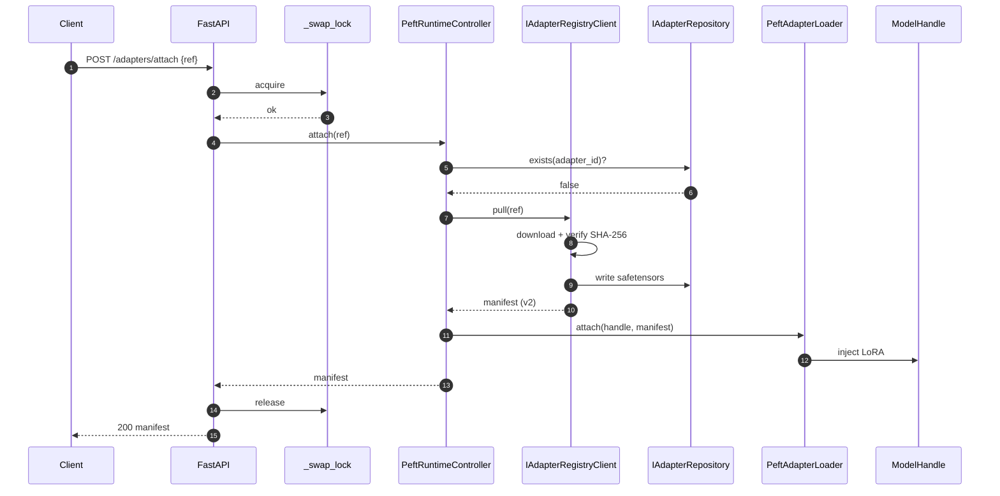
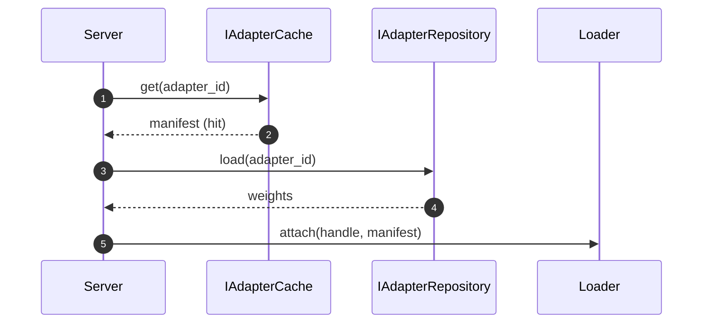

# Server Architecture — Hot-Swap Inference

> **Scope**: how `llm-patch serve` (FastAPI) hosts a base model and
> hot-swaps adapters across requests under concurrency. Companion to
> [REGISTRY_PROTOCOL.md](REGISTRY_PROTOCOL.md) and
> [AGENTIC_AI_INTEGRATION.md](AGENTIC_AI_INTEGRATION.md). Decisions
> recorded in [ADR-0006](adr/0006-distributed-adapter-registry.md).

---

## 1. Components

```
                    ┌──────────────────────────────────────────┐
                    │  FastAPI app (server/app.py)             │
                    │  POST /adapters/attach                   │
                    │  POST /adapters/detach                   │
                    │  GET  /adapters/active                   │
                    │  GET  /cache/stats                       │
                    │  POST /infer  (existing)                 │
                    └──────────────┬───────────────────────────┘
                                   │ asyncio.Lock (_swap_lock)
                                   ▼
                    ┌──────────────────────────────────────────┐
                    │  IRuntimeAdapterController               │
                    │  (PeftRuntimeController, RLock)          │
                    └──┬─────────────────┬─────────────────┬───┘
                       │                 │                 │
              ┌────────▼─────┐  ┌────────▼──────┐  ┌───────▼──────────┐
              │ IAdapterCache│  │ IAdapter      │  │ IAdapterRegistry │
              │ (LRU,        │  │ Loader        │  │ Client (optional)│
              │  manifests)  │  │ (PEFT)        │  │                  │
              └──────────────┘  └────────┬──────┘  └──────────────────┘
                                         │
                                         ▼
                                  ┌───────────────┐
                                  │ ModelHandle   │
                                  │ (single GPU)  │
                                  └───────────────┘
```

## 2. Concurrency model

**Single global swap lock.** Every attach/detach grabs
`server.app._swap_lock` (an `asyncio.Lock`) before touching the
controller. Generation requests do **not** hold the lock — they read
the live `ModelHandle` only. Net effect:

| Operation | Holds `_swap_lock`? | Notes |
|---|---|---|
| `POST /infer` | No | Reads handle; no GPU mutation. |
| `POST /adapters/attach` | Yes | Serializes against detach + other attach. |
| `POST /adapters/detach` | Yes | Same. |
| `GET /adapters/active` | No | Read-only. |
| `GET /cache/stats` | No | Read-only. |

Inside the controller, a `threading.RLock` re-serializes attach/detach
across non-asyncio callers (e.g. CLI in-process tests, MCP tools).

This is intentionally simpler than LoRAX-style batched multi-adapter
inference. It is correct, portable, GPU-agnostic, and good enough for
"tens of adapters on one node". Replacing the lock with LoRAX is
tracked as a future ADR.

## 3. Lifecycles

### 3.1 Cold attach



### 3.2 Warm-from-cache attach



### 3.3 Eviction

`LRUAdapterCache` evicts the least-recently-used **manifest** when
capacity is exceeded. Evicted manifests stay materialized on disk
(`IAdapterRepository`); only the in-memory pointer is dropped. The PEFT
LoRA module remains attached to the handle until an explicit `detach`.
Eviction therefore has **no GPU footprint impact** today; treating
manifest eviction as a hint for opportunistic GPU detach is left for a
future LoRAX ADR.

### 3.4 Concurrent attach contention

Two clients calling `POST /adapters/attach` simultaneously serialize on
`_swap_lock`. The second request blocks at the FastAPI layer until the
first completes; from the client's perspective it is a normal HTTP
latency. No request is dropped; ordering is FIFO per the asyncio lock.

## 4. VRAM footprint estimator (static)

For a LoRA with rank `r`, hidden size `h`, attaching to `L` layers and
`M` target modules per layer at `b` bytes per parameter:

$$\text{VRAM}_\text{LoRA}(r, h, L, M, b) \;\approx\; 2 \cdot r \cdot h \cdot L \cdot M \cdot b$$

The factor of 2 accounts for the `A` and `B` matrices. For a
`google/gemma-2-2b-it` (h=2304, L=26, M=2, fp16 b=2) with `r=8`:

$$2 \cdot 8 \cdot 2304 \cdot 26 \cdot 2 \cdot 2 \;=\; 3.83\ \text{MiB per adapter}$$

This is an upper-bound *static* estimate. The engine ships
`runtime/preflight.py` which exposes `PreflightReport` (CUDA/VRAM
discovery via lazy `torch` import) but **does not** yet measure live
allocator residency. Live measurement is deferred per ADR-0006.

## 5. Failure mapping

| Exception | HTTP status | Endpoint behavior |
|---|---|---|
| `RegistryUnavailableError` | 503 | Returned when no registry is configured but a hub URI was sent. |
| `AdapterNotFoundError` | 404 | Unknown `ref`. |
| `IncompatibleBaseModelError` | 409 | Manifest's `base_model_compatibility` excludes the loaded base model. |
| `ChecksumMismatchError` | 502 | Payload digest disagreed during pull. |
| `CapacityExceededError` | 507 | Cache misconfigured (`capacity <= 0`). |
| Any other `LlmPatchError` | 500 | Mapped to JSON error body via shared error contract. |

## 6. Roadmap (out of scope here)

- LoRAX-driven batched multi-adapter inference (replaces global lock).
- Live VRAM accounting + GPU-aware eviction policy.
- Multi-GPU sharding / tensor parallelism.
- Persistent attached-adapter state across server restarts.
